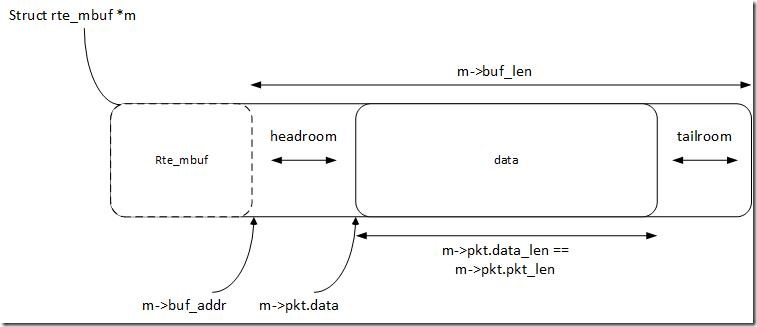
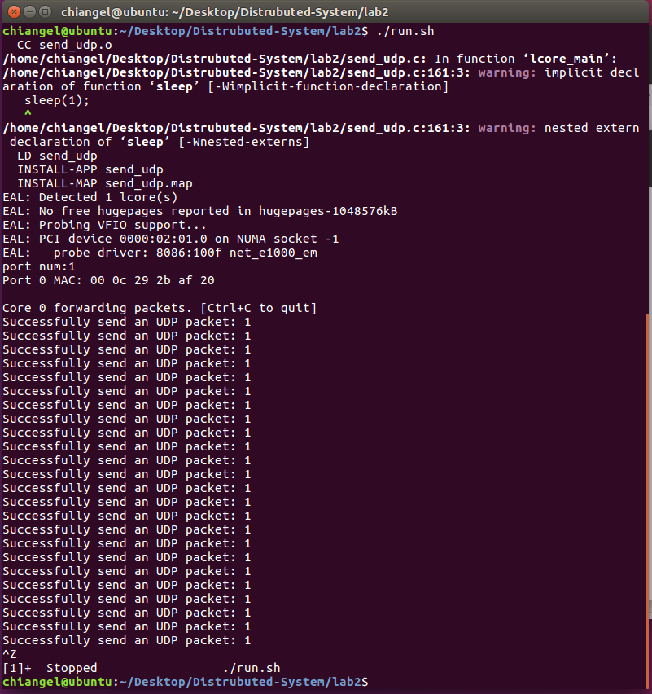
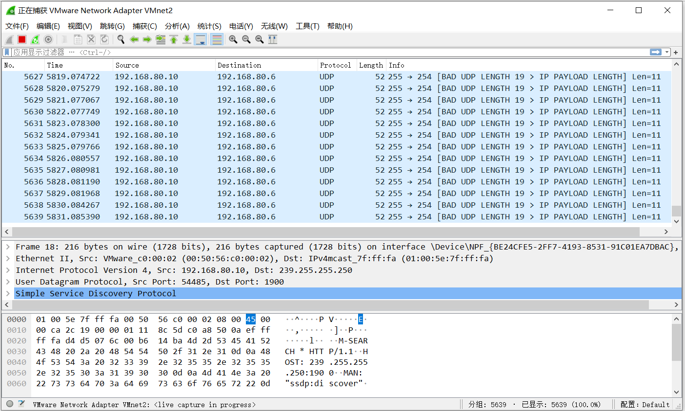

# Distributed System Lab 2

## Personal information

- Student ID: 517021910674
- Student Name: Lin Jianghao

## Part 1

- **Q1:** What’s the purpose of using hugepage?

- **A1:** The usage of the huge page will reduce the number of page table entry and increase the hit rate of TLB, leading to the acceleration of memory access.

- **Q2:** Take ```examples/helloworld``` as an example, describe the execution flow of DPDK programs?

- **A2:** The excution flow of the DPDK program ```examples/helloworld``` can be described as follows: 
    1. Initialize basic running environment by calling function ```rte_eal_init```
    2. Initialize multi-core running by calling function ```rte_eal_remote_launch```.
    3. Call function ```lcore_hello``` on each slave logical core.
    4. Call function ```lcore_hello``` on the master logical core.
    5. Wait all logical cores to finish executing using function ```rte_eal_mp_wait_lcore```.

- **Q3**: Read the codes of ```examples/skeleton```, describe DPDK APIs related to sending and receiving packets.

- **A3** : DPDK APIs related to sending and receiving packets I find are shown below:
    1. Create mempool API: create a memory pool for storing rte_mbuf.
    ```c
    struct rte_mempool *rte_pktmbuf_pool_create(const char *name, unsigned n, unsigned cache_size, uint16_t priv_size, uint16_t data_room_size, int socket_id)
    ```
    2. Allocate API: apply a rte_mbuf from memory pool
    ```c
    struct rte_mbuf *rte_pktmbuf_alloc(struct rte_mempool *mp)
    ```
    3. Receive API: 
    ```c
    static inline uint16_t rte_eth_rx_burst(uint8_t port_id, uint16_t queue_id, struct rte_mbuf **rx_pkts, const uint16_t nb_pkts)
    ```
    4. Send API:
    ```c
    static inline uint16_t rte_eth_tx_burst(uint8_t port_id, uint16_t queue_id, struct rte_mbuf **tx_pkts, uint16_t nb_pkts)
    ```
    5. The descriptions of parameters and returns for Receive API and Send API:
        - 1st arg: port number
        - 2nd arg: queue identifier
        - 3rd arg: packet buffer
        - 4th arg: the number of packets that we want to receive or send
        - return: the number of packets that we actually receive or send

- **Q4**: Describe the data structure of ```rte_mbuf```.

- **A4**: The description of ```rte_mbuf``` is shown below:
    1. ```rte_mbuf``` structure describes a packet mbuf, which contains a data buffer. The image below shows the structure of rte_mbuf.

        

    2. DPDK will reserve some headroom when function ```rte_pktmbuf_alloc``` is called to allocate a new rte_mbuf.
    3. When trying to write data into rte_mbuf, we can use function ```rte_pktmbuf_prepend``` or ```rte_pktmbuf_append``` to increase the size of headroom or tailroom. 

## Part 2

Here are my workflow for part 2:

1. Install wireshark on my physical machine.
2. create and enable a virtual NIC in VMWare (VMnet2).
3. Wrtie and start the DPDK application ```send_udp```
4. Use wireshark to capture the packets on VMnet2.
5. Detect UDP packets from the virtual machine. I set the payload of each UDP packet to be "LinJianghao". The payload of every UDP packet the wireshark receives is of the same length as "LinJianghao" (length of 11).

Here are my screenshots for part 2:





## Suggestions for lab2

Many of us came into a problem of ```Input/output error```. For DPDK 16.8 in ubuntu 16.08, a patch ([http://patches.dpdk.org/patch/945/](http://patches.dpdk.org/patch/945/)) is useful for these errors. I suggest add this patch information into the lab document for the next year teaching.
