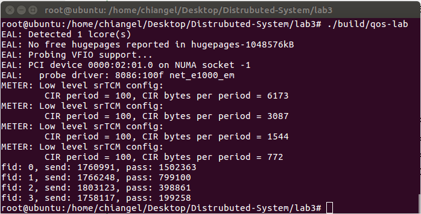
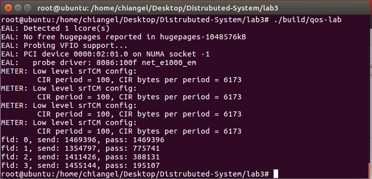

# Distributed System Lab 3

## Personal information

- Student ID: 517021910674
- Student Name: Lin Jianghao

## Parameter deduction process

I find two ways of parameter deduction to achieve the requirement.

### Method 1

In Method 1, I use srTCM to control service and make all different flows share exactly the same RED parameters. Here are the details:

1. Paramater deduction of srTCM
    - According to the required bandwidth of Flow 0 (1.28 Gbps), we can calculate the CIR out (1.28 Gbps = 1.28/8 GB/s = 0.16 GB/s).
    - Divide the CIR into two buckets of the same size.
    - According to the bandwidth proportion of 8:4:2:1, srTCM parameters of other flows can be calculated out.

        ```c
        struct rte_meter_srtcm_params app_srtcm_params[] = {
            {.cir = 1000000000000 * 0.16,  .cbs = 80000, .ebs = 80000},
            {.cir = 1000000000000 * 0.08,  .cbs = 40000, .ebs = 40000},
            {.cir = 1000000000000 * 0.04,  .cbs = 20000, .ebs = 20000},
            {.cir = 1000000000000 * 0.02,  .cbs = 10000, .ebs = 10000},
        };
        ```

2. Parameter deduction of WRED
    - Simply copy the value of ```maxp_inv``` and ```wq_log2``` in ```DPDK/examples/qos_sched/init.c```.
    - Drop all packets of ```red``` color and enqueue all packets of ```green``` or ```yellow``` color.

        ```c
        struct rte_red_config app_red_params[APP_FLOWS_MAX] = {
            [0] = {.min_th = 1022 << 19, .max_th = 1023 << 19, .maxp_inv = 10, .wq_log2 = 9},
            [1] = {.min_th = 1022 << 19, .max_th = 1023 << 19, .maxp_inv = 10, .wq_log2 = 9},
            [2] = {.min_th = 0, .max_th = 1, .maxp_inv = 10, .wq_log2 = 9},
        };
        ```

### Method 2

In Method 2, I use WRED to control service and make all different flows share exactly the same srTCM parameters. Here are the details:

1. Paramater deduction of srTCM
    - Because all different flows share exactly the same srTCM parameters, CIR is equal to the required bandwidth of Flow 0 (1.28 Gbps = 0.16 GB/s)
        ```c
        struct rte_meter_srtcm_params app_srtcm_params[] = {
            {.cir = 1000000000000 * 0.16,  .cbs = 60000, .ebs = 50000},
        };
        ```

2. Parameter deduction of WRED
    - Set the value of ```wq_log2``` to be 1, 2, 3, 4 to mark the weights of different queues.
    - Set the value of ```min_th``` and ```max_th``` to control the service according to the bandwidth proportion of 8:4:2:1.
    - Keep the value of ```maxp_inv``` the same as it is in Method 1.
        ```c
        struct rte_red_config app_red_params[APP_FLOWS_MAX][3] = {
            /* Flow 0 */
            [0][0] = {.min_th = 480 * 2000, .max_th = 640 * 2000, .maxp_inv = 10, .wq_log2 = 1},
            [0][1] = {.min_th = 400 * 2000, .max_th = 640 * 2000, .maxp_inv = 10, .wq_log2 = 1},
            [0][2] = {.min_th = 320 * 2000, .max_th = 640 * 2000, .maxp_inv = 10, .wq_log2 = 1},

            /* Flow 1 */
            [1][0] = {.min_th = 480 * 1200, .max_th = 640 * 1200, .maxp_inv = 10, .wq_log2 = 2},
            [1][1] = {.min_th = 400 * 1200, .max_th = 640 * 1200, .maxp_inv = 10, .wq_log2 = 2},
            [1][2] = {.min_th = 320 * 1200, .max_th = 640 * 1200, .maxp_inv = 10, .wq_log2 = 2},

            /* Flow 2 */
            [2][0] = {.min_th = 480 * 900, .max_th = 640 * 900, .maxp_inv = 10, .wq_log2 = 3},
            [2][1] = {.min_th = 400 * 900, .max_th = 640 * 900, .maxp_inv = 10, .wq_log2 = 3},
            [2][2] = {.min_th = 320 * 900, .max_th = 640 * 900, .maxp_inv = 10, .wq_log2 = 3},

            /* Flow 3 */
            [3][0] = {.min_th = 480 * 600, .max_th = 640 * 600, .maxp_inv = 10, .wq_log2 = 4},
            [3][1] = {.min_th = 400 * 600, .max_th = 640 * 600, .maxp_inv = 10, .wq_log2 = 4},
            [3][2] = {.min_th = 320 * 600, .max_th = 640 * 600, .maxp_inv = 10, .wq_log2 = 4},
        };
        ```

## DPDK APIs that I use

- ```rte_meter_srtcm_config()```: Initialize srTCM data according to the parameter settings.
- ```rte_red_rt_data_init()```: Initialize RED data.
- ```rte_red_config_init()```: Initialize RED config according to the parameter settings.
- ```rte_meter_srtcm_color_blind_check()```: Mark the input packet with red/green/red colors using blind check algorithm.
- ```rte_red_mark_queue_empty()```: The queue-empty API.
- ```rte_red_enqueue()```: The API for enqueue operations.

## Test results

In this part, I put screen shots of the test result. Also, I modify the ```main.c``` to run repeated tests for 1,000,000 times to get the average bandwidth of Flow 0 and the average proportion. The modified source code is also handed in, named as ```main_for_test.c```.

### Method 1



My tested average bandwidth of Flow 0 is 1.31 Gbps. The average proportion is 7.2 : 4.1 : 2.0 : 1.0 .

### Method 2



My tested average bandwidth of Flow 0 is 1.42 Gbps. The average proportion is 7.8 : 3.9 : 1.9 : 1.0 .