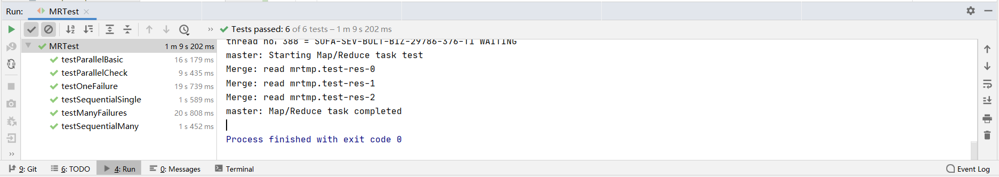
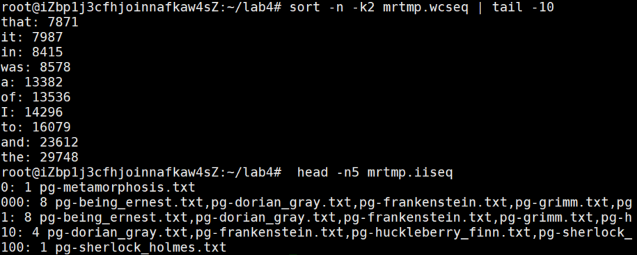

# Distributed System Lab 4

## Personal information

- Student ID: 517021910674
- Student Name: Lin Jianghao

## Part 1

In this part, I finish the ```doMap()``` and ```doReduce()``` function. Here is the discription of my implementation:

- ```doMap()```
  1. First, we read the input file and call the user-defined map function to do the data processing.
  2. A ```List<KeyValue>``` is returned. For each element in the list, we call the ```hashCode``` function to decide which mahcine it will be excuted on.
  3. According to the target machine number, we generate the corresponding file name and save the intermediate output. Here, JSON is used for the convenience of encoding and decoding.
- ```doReduce()```
  1. First, we read the intermediate files, which is generated by the ```doMap()``` function, and decode the content into a ```List<KeyValue>```.
  2. Sort the list by key.
  3. Traverse the list. for several elements with the same key, we call the user-defined reduce function and save the output into one file.

## Part 2

In this part, I finish the ```mapFunc()``` and ```reduceFunc()``` function in ```WordCount.java```. Here is the discription of my implementation:

- ```mapFunc()```
  1. Using the regular expression library, we match the input string value.
  2. For each word ```w```, we generate a ```KeyValue``` pair of ```<w, "1">```.
- ```reduceFunc()```
  1. Because input elements to the ```reduceFunc()``` have the same key (i.e. the same word), the length of the string array is just the count of the word.

## Part 3 & 4

Because the implementations of part 3 & 4 are highly related in the same file ```Scheduler.java```, so I decribe my implementation of them together. Also, a private class ```WorkerThread```, extending the class ```Thread```, is created for the implementation.

- ```schedule()```
  1. Create a global ```ConcurrentHashMap``` to record the process of each task. For each task. add the unfinished tag of the task into the ```ConcurrentHashMap```.
  2. Tranverse the hash map repeatedly until all tasks in the map is finished.
  3. For each unfinished task in the hash map, use the ```registerChan``` to get available node and assign the work.
  4. For each worker, we create a ```WorkerThread``` object. When the task is finished, count down the ```countDownLatch``` and assign it with ```true``` in the hash map.
  5. If a task is not returned (a.k.a. ```countDownLatch``` is not zero) after several seconds (here we set it to be 10 seconds), we re-assign the task.

## Part 5

In this part, I finish the ```mapFunc()``` and ```reduceFunc()``` function in ```InvertedIndex.java```. Here is the discription of my implementation:

- ```mapFunc()```
  1. Using the regular expression library, we match the input string value.
  2. For each word ```w```, we generate a ```KeyValue``` pair of ```<w, file>```. The ```file``` is the input filename.
- ```reduceFunc()```
  1. Because input elements to the ```reduceFunc()``` have the same key (i.e. the same word), we only need to find all the different filename, sort the filenames and store them into a string.

## Test Result

My implementation has passed the six test functions. The screenshot is shown below:



As for the correctness of ```WordCount``` and ```InvertedIndex```, I use the recommended command in the document and get the same result. The screenshot is shown below:

